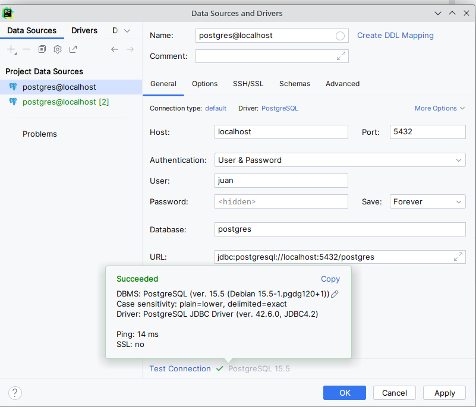

# Tutorial de instalación de Odioo

## Paso I: Creación y lanzamiento del docker compose.
Una vez listos el servicio de docker 
en el IDE que uses y el docker desktop,
cogemos el docker compose que está en el repositorio 
y escribimos en el docker compose up.

Una vez levantado, vampos a la pagina local de él 
y escribimos los siguientes datos:
- En master password: escribimos la password(que es la misma en postgres.)
- En database name ponemos el nombre de tu host en el docker compose.
- Lo demas va a tu propia elección.

## Paso II: Conexión a postgres
Cogeremos PyCharm para este paso:

Una vez abierto este IDE, haremos lo siguiente.
Iremos al icono de Database a la derecha, despues al botón + (o new).
Tras esto iremos a Data Source > PostgreSQL. 
En el nos aparecerá este formulario a rellenar.
Lo único que tocaremos ahí sera el user y password:
En el se pondrá el POSTGRES_USER y POSTGRES_PASSWORD del docker compose.

### Y si el puerto 5432 lo tengo bloqueado en mi ordenador, que puedo hacer?

No hay problema! Solo tira el contenedor y haz un
nuevo cambio en el docker compose. Como ves en el -db ahí
debajo de image hay una sección llamada -ports: 
Solo cambia el primer numero de el por el que quieras.
Yo por ejemplo le puse el 6666 y lo comenté ahí por si acaso.

Una vez hecho el cambio en el docker compose,
haz casi lo mismo que todo lo mencionado anteriormente. 
Lo único distinto es a la hora de poner ports, en vez del 5432,
pones el que quieras.

Hacemos un par de pruebas para comprobar su funcionamiento y listo.
Acá están los resultados:

